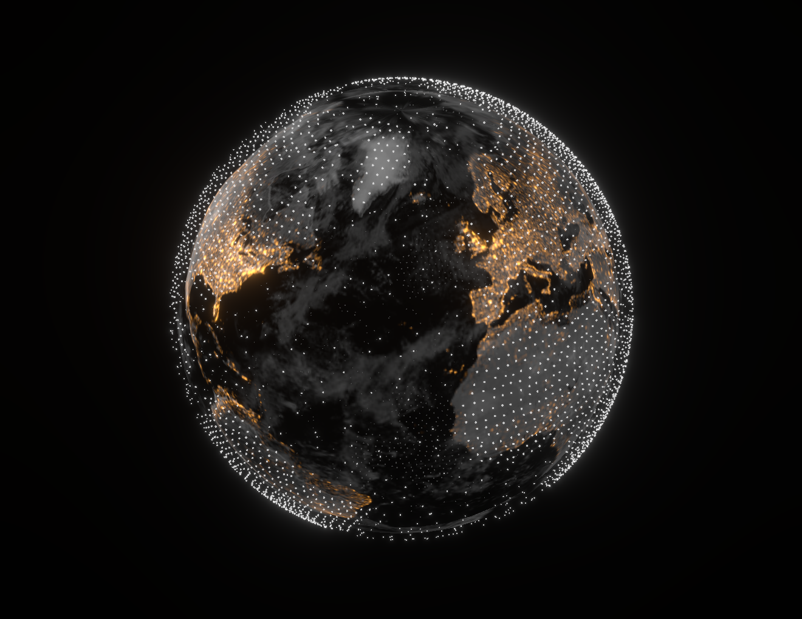

# Interactive 3D Earth Globe with WebGL and Three.js - FUI HUD Sci-Fi Interface Visualization


Interactive 3D Earth planet visualization built with WebGL, Three.js, and React Three Fiber. A futuristic FUI (Futuristic User Interface) and HUD (Heads-Up Display) style 3D globe sandbox demonstrating sci-fi interface design patterns.

## Interactive 3D Earth Visualization Project

This project is a **3D WebGL sandbox** demonstrating how to implement an **interactive Earth planet visualization** in a futuristic **FUI (Futuristic User Interface)**, **HUD (Heads-Up Display)**, and **sci-fi interface style** using **Three.js** and **React Three Fiber**.

A technical showcase and playground for creating immersive 3D planetary visualizations with:

- **WebGL-powered rendering** for high-performance 3D graphics
- **Interactive Earth sphere** with realistic textures, atmospheric layers, and point cloud representations
- **Futuristic UI aesthetics** inspired by sci-fi interfaces, HUD displays, and techno-UI design
- **Real-time 3D controls** with rotation, zoom, and layer visibility toggles
- **Modern web technologies** stack for building cutting-edge 3D web experiences

Perfect for developers exploring **Three.js**, **WebGL**, **3D visualization**, **interactive globes**, **FUI design**, **HUD interfaces**, and **sci-fi UI** implementations.

## Live Demo and Visual Showcase

<div align="center">

### FUI Globe



Interactive 3D WebGL visualization of the Earth in a futuristic digital interface style (HUD, FUI)

<video src="docs/vids/fui-globe.mp4" controls width="600" autoplay loop muted>
Your browser does not support the video tag.
</video>

</div>

### Visual Style & Design Language

This aesthetic sits at the intersection of **Cinematic Data Visualization** and **FUI (Fictional/Futuristic User Interface)**. It draws heavily from the visual language of **Cyberpunk**, **Tech Noir**, and high-tech **HUD (Heads-Up Display)** systems seen in sci-fi cinema.

Key stylistic elements include:

- **Holographic Projection**: High-contrast "night mode" visualization where data (city lights, borders) glows against deep black space, simulating a light-based projection rather than physical matter.
- **Volumetric Point Clouds**: Using a particle system (points) to represent the atmosphere and boundaries, creating a sense of volume and density without solid meshes.
- **Computational Aesthetic**: A "Digital Twin" look that emphasizes the mathematical grid and raw data points, trading photorealism for technological elegance and informational clarity.
- **Chiaroscuro & Glow**: Strong interplay between light and dark, using emissive textures to highlight population centers (night lights) as the primary light source.

### WebGL Globe

A more minimalist variant - Dotwork Point Cloud, Point-Wireframe, Computational Aesthetic

<video src="docs/vids/wegl-globe.mp4" controls width="600" autoplay loop muted>
Your browser does not support the video tag.
</video>

## Extended Visual Theory & Design Rationale

The visual style of this project is formed at the intersection of **FUI (Futuristic/Fictional UI)**, **Cinematic Data Visualization**, **Procedural Graphics**, **Scientific Imaging**, and **Parametric Design**. It relies on the aesthetics of **high-tech minimalism**, uses the language of **data-driven motion**, and builds an image of a digital world through light but precise structural elements.

It combines mathematical purity with cinematic emotion, creating an interface that belongs to the future: lightweight, computational, and data-breathing. Points displace polygons, glow replaces material, and motion becomes structure.

### Core Visual Concepts

_Taxonomy of the style_

- **Point-Cloud Visualization** — Graphics built on point clouds instead of polygons, creating a sense of light digital matter.
- **Dotted Wireframe / Dot-Mesh Geometry** — Wireframe structures and solid forms described by discrete points.
- **Volumetric Rendering via Particles** — Volume created not by geometry, but by particles in 3D space.
- **Holographic Tech Aesthetic** — Visual language of projections and glow, typical for sci-fi HUD and AR interfaces.
- **Parametric & Algorithmic Shape Language** — Forms and patterns as a result of calculations rather than manual drawing.
- **Generative Motion Design** — Animations based on mathematics, curves, vectors, noise, and forces.
- **Computational Minimalism** — Rejection of heavy materials in favor of mathematically pure visual structure.
- **Cinematic Space Composition** — Composition inspired by space movies, NASA interfaces, and industrial design of space systems.
- **Digital Chiaroscuro** — Dramatic contrast of light and shadow based on the emissive channel and physics of night glow.
- **Tech Noir Palette** — Cold shades, monochrome, gold/amber as an accent of civilization's light.

### Design Language Hierarchy

_Elements of the system_

1. **Points** — Atomic units of visual matter.
2. **Fields** — Fields of points and data creating topology.
3. **Flows** — Dynamics of rotation, distribution, and axial motion.
4. **Contours** — Hints of boundaries without solid lines.
5. **Glow** — Soft glow as an information carrier.
6. **Contrast** — Deep black background as information void.
7. **Density** — Point density as a visual equivalent of mass.
8. **Motion** — Rotations, displacements, light vibrations as the system's breath.

### Related Aesthetic Families

_Keywords for context and discovery_

> Sci-Fi Interface Design, HUD/HMI Visualization, Cyberpunk User Interface, Neo-Futuristic Data Art, Astrovisualization, Space Data Rendering, Procedural WebGL Graphics, Shader-Based Rendering, Digital Cartography, Geospatial Visualization, Computational Design Systems, Parametric Data Sculpting, High-Tech Infographics, Generative 3D UI, Abstract Data Environments, Cinematic UI Motion, Tech Minimalist Aesthetic, Fictional Interface Design (FUI).

## Technology Stack and Dependencies

- Next.js 15
- React 19
- TypeScript
- Three.js
- React Three Fiber
- Tailwind CSS

## Getting Started - Installation and Setup Guide

```bash
# Install dependencies
npm install

# Run dev server
npm run dev

# Build for production
npm run build

# Run production version
npm start
```

Open [http://localhost:3000](http://localhost:3000) in your browser.

## Interactive Controls and User Interface

- **Left mouse button** - rotate globe
- **Mouse wheel** - zoom in/out
- **Selects** - display controls

## Project Architecture and File Structure

```
webgl-digital-globe/
├── app/
│   ├── layout.tsx       # Application layout
│   ├── page.tsx         # Main page
│   └── globals.css      # Global styles
├── components/
│   └── Globe.tsx        # 3D globe component
└── public/              # Static files
```

## License

MIT
